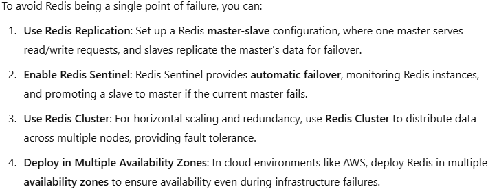
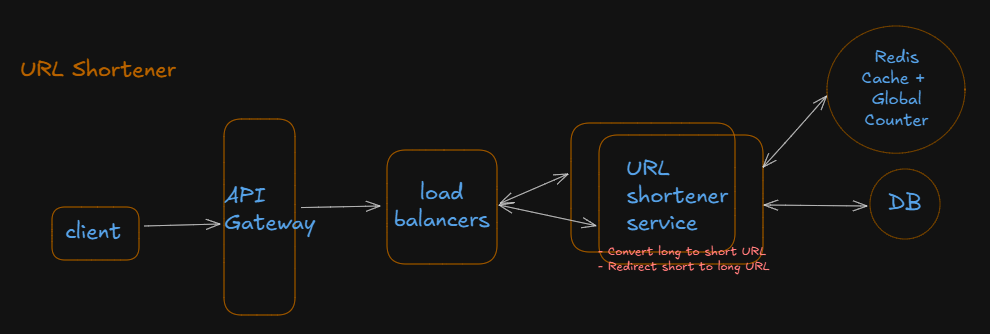

### Functional Requirements:

1. long url --> short url [https://bit.ly/3YXDfQO]
2. Given short url Redirect to long url
3. Support Alias i.e user provided Short URL
4. Support expiration

### Non Functional Requirements:

1. Consistency or Availability - (Eventually Consistent with Availability for this application)
2. Scalability - (100mil DAU, 1bil URLs)
3. Low Latency - redirection should be fast(200ms)
4. System need guarantee uniqueness of short codes in urls.

**`Back of the Envelope Calculations - Traffic Estimates`**

10^8 DAU * 5 Read/Write = 50^8 tx/day = 50^8/24*60*60= 5788 tx/second

1 thread in server = 200ms for one request = 5 requests in 1 second

50 threads in server = 50 threads can execute 250 requests in 1 second by 1 server

Number of servers = 5788/250 = 23 servers rqd to serve 100mil DAU

**`Back of the Envelope Calculations - Storage Estimates`**

Based on the **`URL`** table below - 

shortUrl(8 bytes), longUrl(500 bytes), currentTime(8 bytes), expirationTime(8 bytes) , userId(10 bytes), alias(10 bytes) = Total 544 bytes each record

5 new URL by each user = 500 million URLs per day by 100 million DAUs = 500 million * 0.5 KB = 250 GB storage rqd each day = 445 TB in years (_not realistic_)

say , 1 billion URLs need to be persisted across 5 years each requiring 500 bytes of storage

500 bytes * 1 billion = 500 GB (_more reasonable_)

### Core Entities:

- Original URLs
- Short URLs
- User

### API and Interface:

**Create Short URLs form Long URLs**

**`REQUEST`**: 
`POST /urls 
{
    originalURL: "",
    alias: "",
    expirationTime:""
}`

**`RESPONSE`** - short URL

**Redirect to Original URL**

**`REQUEST`**: `GET {shortUrl}`

**`RESPONSE`**:
HTTP/1.1 302 Found 
Location: _Long Url_

### Data Flow:

- **URL**
  shortUrl (pk),
  longUrl,
  currentTime,
  expirationTime,
  userId,
  alias

- **USER**
  userId,
  user_details 

### High Level Design:

1. User requests for a Short URl for a Long URl using the above mentioned API.
2. URL Shortener service will check in DB if the short code already exists, otherwise generate a new short URL and respond back.
3. If alias is provided, use it to generate short URL unless it's already been used
4. User requests to redirect for a short URL.
5. URL Shortener service will fetch the Long URL for the short URL and set response status as 302 and Location as Long URL.
   (other redirect status 301 will cache the Location hence avoiding direct hit to server which may not be useful if you need to run Analytics on the system)
6. If the expirationTime for the record has expired, respond back with error message and ask to generate a new short URL

* checking if short URL already exists for every Create request is an overkill especially when we're dealing with a million users daily.
  we can cache short URLs but still will be an extra lookup
* how to validate if alias name is not already taken? Try BloomFilter
* How to generate the Short URL efficiently? need a way to generate short URLs without any collisions and reducing the need for extra lookup.
* What are the different ways of generating unique alphanumeric 7 characters for a long URL with minimum collisions.

### Deep Dives: 

1. **`Uniqueness of short URLs`**
Let's try various techniques to produce unique URLs 
- Hashing the URL using MD5.Convert the above Hash using Base 62 encoding.
  
  | **Advantages**                                  | **Drawbacks**                                                   |
  |-------------------------------------------------|-----------------------------------------------------------------|
  | Easy to implement.                              | Prone to collisions if the 7-character limit truncates uniqueness. |
  | Deterministic (same input generates the same output). |                                                                 |

- Random Generation with Base62 encoding.

  | **Advantages**                                  | **Drawbacks**                                                   |
  |-------------------------------------------------|-----------------------------------------------------------------|
  | Efficient encoding using a small set of characters.                              | Potential collisions if not carefully handled. |
  | Compact representation. |                                                                 |

- Incremental Counter with Base62 Encoding

  | **Advantages**                                  | **Drawbacks**                                                   |
  |-------------------------------------------------|-----------------------------------------------------------------|
  | No collisions.                              | Requires a persistent counter storage. |
  | Efficient and deterministic. | Sequential identifiers might be less secure or predictable.                                         |

- Using https://sqids.org/java generate unique IDs from numbers. It's good for link shortening, fast & URL-safe ID generation and decoding back into numbers for quicker database lookups.

- Global Counters using REDIS
  1. Use Redis's `INCR` command to get a unique incremental integer.
  2. Implement a method to convert the incremental integer to Base62 encoding.
  3. Use the Base62 string as the unique identifier.

2. INDEXing the short URL for queries.
3. LRU CACHE the active short URLs in a REDIS server. Eviction required on expiration. CDN based CACHing will not be good for analytics.

4. Need to scale the URL Shortener service to serve 100mil DAU
- if more Read , spin up more READ servers compared to WRITE servers
- sometimes separating based on READ and WRITE may be overkill.
- a normal t3.medium Ec2 server can handle 1k - 5k RPS(request per second). Base on our calculations above, to serve 5788 rps 2 t3.medium should be sufficient.
- AWS Autoscaling

5. As we scale, we need to handle the Counter(if managed by each server) to avoid conflicts
- Implement Global Counter with REDIS
- Load 1k counters from REDIS to server memory(_ConcurrentHashMap_) for performance. Keep a track of the used counters in memory.
- even if the server gets down or memory crashes, we'll lose that set of 1k counters which are yet to be persisted and can load next set of 1k counters

6. Do we need to scale the Database
- validate the storage based calculations above = 500 GBs in 5 years
- a Postgres AWS RDS instance can go upto 64 TBs.
- so database should be sufficient to support the storage for 5 years
- No sharding required.

7. How to maintain `Availability` of the system.
- Single point of Failure - REDIS

- Read/Write replicas for database if using AWS.
- or regular snapshots.

-----------------------Q------------------------
1. How REDIS manage concurrency in a Distributed System i.e. multiple application servers using same REDIS instance.

