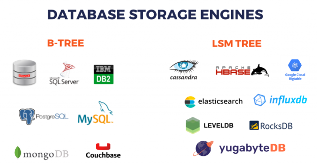

# How To Choose The Right Database For Your Application
## Types of Databases

### **`Key Value Database`** 
- Redis, Memcached
- Fast read and write
- Read from memory
- Used for caching, pub/sub, leaderboards
- Use cases - 
  - [How Twitter uses Redis to scale]()
  - [How GitHub uses Redis to scale]()
  - [How key value data store scales using consistent hashing?]()

### ** `Column-Oriented Database` **
- Amazon Redshift, Google BigQuery
- Store data in columns rather than rows i.e all values of a single column across rows would be stored together.
- Optimized for read-heavy workloads that involve large volumes of data especially when queries involve aggregations, filtering and analytical operations on columns.
- Higher compression rates compared to row-based databases because similar data types are stored together
- Designed to scale horizontally, handling large volumes of data across distributed systems.
- Columnar databases are ideal for data warehousing environments where large volumes of historical data are stored and analyzed.
- Columnar databases can be beneficial in ETL (Extract, Transform, Load) processes.

### **`Wide Column Store`**
- Cassandra, Hbase
- Distributed, scalable 
- Used for time series data, IOT, sensor data
- Schemaless, without joins
- Write heavy workloads, it uses LSM(Log Structured Merge) tree for write operations which buffers writes in memory and periodically flushes to disk making writes faster.
- Cassandra organizes data into rows and columns, but each row can have a different set of columns.
- In Cassandra's internal storage, all the columns for a single row are stored together on disk. This is different from true columnar databases where all values of a single column across rows would be stored together.
- Use cases - 
  - [How Netflix uses Cassandra to scale](https://netflixtechblog.com/scaling-time-series-data-storage-part-i-ec2b6d44ba39)
  - [How Cassandra is used for time series data?]()
  - [How does it provide better compression?]()
  - [Why column oriented storage is more suitable for analytical scenarios]()

### **`Document Store`**
- Mongodb, Couchdb, Dynamodb
- Schemaless, flexible, without joins
- Related data is stored together in single document
- Used for content management, blogging platforms
- Store data in JSON format    
- Read heavy workloads
- Write operations are slower compared to read operations as data is stored in JSON format and needs to be parsed before writing to disk.
- Key value pair is stored in a document and documents are stored in a collection. (example: user collection, product collection)
- Document store is a collection of documents and each document is a collection of key value pairs.
- They offer powerful indexing capabilities, allowing developers to create indexes on various fields within documents to optimize query performance.
- Designed to scale horizontally, making it easier to handle large volumes of data across distributed systems.
- Use cases -
  - [How MongoDB is used for content management?]()

### **`Relational Database`** 
- Mysql, Postgresql, Oracle
- ACID properties
- Used for financial transactions, banking, e-commerce
- Scaling is difficult as it's not distributed
- Use case - 
  - [How cockroachdb scales?]()
  - [What are the challenges of distributing a relational database?]()

### **`Graph Database`**
- Neo4j, Arangodb
- Used for social networks, recommendation engines
- Nodes are entities/data
- Edges are relationships
- Traversing relationships is faster
- Use cases - 
  - [How Graph database verifies email addresses?, ip addresses?, fraud detection?]()
  - [How Facebook uses graph database to recommendations?]()

    
### **`Search Engine`**
- Elasticsearch, Solr
- Used for full text search, log analysis, type ahead suggestions
- Data is stored in documents identified by unique keys
- Inverted index stores the unique keys for all documents containing a given data/word.

- Use cases - 
  - [How Elasticsearch is used for log analysis?]()
  - [How Solr is used for type ahead suggestions?]()

## Comparison of Row-Oriented Database and Column-Oriented Database

| Feature                | Row-Oriented Database                      | Column-Oriented Database                                                                                            |
|------------------------|--------------------------------------------|---------------------------------------------------------------------------------------------------------------------|
| Type of workload       | Transactional                              | Analytical                                                                                                          |
| Storage                | Store the complete row in a database block | Store the complete column and records under it in a database block                                                  |
| Accessibility use case | Need to fetch all details of a user        | Get the temperatures of a place within a date window                                                                |
| Compression            | Less efficient                             | More efficient - since same type of data gets persisted in a specific DB block, DB can apply compression algo on it |
| When to Use            | when you need to manage structured data with complex relationships and ensure ACID compliance for transactions. | when managing large volumes of data for analytical processing where read performance, data compression, and column-based queries are prioritized.                                                                             |

## Comparison of Cassandra , HBase and Traditional Columnar Database(Amazon Redshift, Google BigQuery)

| Feature      | Cassandra                                                                                                                                        | HBase                                                                                       | Traditional Columnar Database                                                                                                                                                                        |
|--------------|--------------------------------------------------------------------------------------------------------------------------------------------------|---------------------------------------------------------------------------------------------|------------------------------------------------------------------------------------------------------------------------------------------------------------------------------------------------------|
| Storage      | Data is stored based on a primary key, which consists of a partition key and optional clustering columns to organize data within partitions      | Similar to Cassandra                                                                        | Stores data in a columnar format, which means data for each column is stored together. This allows for high performance in analytical queries that involve operations on columns(e.g., aggregations) |
| Architecture | No single point of failure. Each node in a Cassandra cluster is equal and data is replicated across multiple nodes for fault tolerance           | Uses a master node for coordinating operations and multiple region servers for data storage | Can be deployed on a single node or distributed system.                                                                                                                                              |
| Consistency  | Eventual Consistency : supports tunable consistency levels, allowing trade-offs between consistency and availability                             | Strong Consistency : Ensures strong consistency across reads and writes                     | Strong Consistency : Ensures strong consistency across reads and writes                                                                                                                              |
| Use case     | Suitable for real-time applications that require high availability and scalability, such as IoT, social media analytics , recommendation engines | Used in conjunction with Hadoop for large-scale data processing and analytics               | Primarily used for data warehousing and BI applications, where complex queries and aggregations over large datasets are common                                                                       |

## Comparison of Relational Database and Document Store

| Feature     | Relational Database      | Document Store                                                                                                      |
|-------------|--------------------------|---------------------------------------------------------------------------------------------------------------------|
| Schema      | Fixed schema             | Flexible schema                                                                                                     |
| Data Model  | Normalized data model    | Denormalized data model                                                                                             |
| Querying    | SQL queries              | JSON queries                                                                                                        |
| Performance | Slower read and write operations | Faster read operations compared to write operations                                                                 |
| When to Use | when you need to manage structured data with complex relationships and ensure ACID compliance for transactions.                         | when you need to manage semi-structured data with a flexible schema, making it ideal for content management systems and blogging platforms.                                                                              |

## Comparison of Database vs Data Warehouse vs Data Lake

| Feature     | Database                 | Data Warehouse                                                                                                                                                                       | Data Lake                                                                                                           |
|-------------|--------------------------|--------------------------------------------------------------------------------------------------------------------------------------------------------------------------------------|---------------------------------------------------------------------------------------------------------------------|
| Data        | Structured data          | Structured data                                                                                                                                                                      | Structured, semi-structured, and unstructured data                                                                   |
| Storage     | Store data in tables     | Store data in tables                                                                                                                                                                 | Store data in raw format                                                                                            |
| Querying    | SQL queries              | SQL queries                                                                                                                                                                          | SQL queries, NoSQL queries, and big data processing queries                                                         |
| Use case    | when you need to manage structured data with complex relationships and ensure ACID compliance for transactions. | when you need to manage large volumes of structured data for analytical processing and reporting where read performance, data compression, and column-based queries are prioritized. | when you need to manage large volumes of structured, semi-structured, and unstructured data for big data processing, machine learning, and advanced analytics. |

## ACID

1. Transaction:
 - collection of queries
 - one unit of work
 - example: Account Deposit(SELECT, UPDATE, UPDATE)

2. Atomicity:
 - All queries in a transaction must succeed
 - if one query fails, all prior successful queries in the transaction must rollback

3. Isolation:
 - Can my inflight transaction see changes made by other transactions
 - Read Phenomena
   * Dirty Reads - incomplete commit by other transactions
   * Non-Repeatable Reads - different values for different reads in same transaction as other transactions commited a update in between
   * Phantom Read - different values for different reads in same transaction as other transactions commited a new row in between 
   * Lost Updates - 2 transactions read same record at same time but updates from one transaction will be lost by another transaction
 - Isolation Levels
   * Read Uncommitted - No isolation, any changes from outside is visible to the transaction,commited or not.
   * Read Commited - Each query in a transaction only sees commited changes by other transactions
   * Repeatable Reads - The transaction will make sure that when a query reads a row, that row will remain unchanged the transaction while it's running
   * Snapshot - Each query in a transaction only sees changes that have been committed upto start of the transaction. It's like a snapshot version of the database at that moment
   * Serializable - Transactions are run as if they serialized one after another.
   * Each DBMS implements Isolation Level different
   * Pessimistic - Row level locks, table locks, page locks to avoid lost updates
   * Optimistic - No locking, just track if things changed and fail the transaction if so
   * Repeatable Read "locks" the rows it reads but it could be expensive if you read a lot of rows, postgres implementation RR as snapshots.That is why you don't get phantom reads with postgres in repeatable read. When user tries to update and save an outdated snapshot, PostgreSQL detects an unresolvable conflict and stops your transaction, throwing an error called a "Serialization Failure" (SQLSTATE '40001').
   * Serializable are usually implemented with optimistic concurrency control, you can implement it pessimistically with SELECT FOR UPDATE 

4. Consistency:
 - If a transaction commited a change will a new transaction immediately see the changes?
 - Affects the system as a whole
 - Relational and NoSQL databases suffer from this.
 - Eventual Consistency

5. Durability:
 - Changes made by a committed transaction must be persisted in a durable non-volatile storage.
 - Durability Techniques
   * WAL - Write Ahead Log
   * Asynchronous Snapshot
   * AOF - Append Only Files

`postgres# begin transaction isolation level repeatable read`
By default i.e `begin transaction` if 2 transaction are trying to update the same row, example - `quantity=quantity+10`, then -
 - 2nd transaction will wait for the 1st transaction(who triggered the UPDATE query) to commit;
 - Once 1st transaction is committed, 2nd transaction will fetch the latest value of `quantity`
 - 2nd transaction will do `quantity=quantity+10` on the updated value of `quantity` and commits.

## How tables and indexes are stored in disk

- ROW_ID - Internal and System Maintained, in certain databases(mysql-innoDB) it is same as the primary key but in other databases like Postgres have a system column row_id(tuple_id)
- Page -
  * Depending on the storage model(row or column store), the rows are stored and read in logical pages
  * The database does not read a single row, it reads a page or more in a single IO and we get a lot of rows in that IO
  * Each page has a size(e.g 8KB in postgres, 16KB in MySQL)
  * Assume each page has 3 rows, with 1001 rows you'll have 333~ pages
  * https://gehc-dt.udemy.com/course/database-engines-crash-course/learn/lecture/37150148#overview
  * Row-store databases write rows
  * Column-store databases write the rows in pages column by column
  * Document based databases compress documents and store them in page
  * graph based databases persist the connectivity in pages such that page read is efficient for traversing graphs
  * Postgres Default page size is 8KB, MySQL InnoDB is 16KB, MongoDB WiredTiger is 32KB, SQL Server is 8KB and Oracle is also 8KB.
- IO
  * IO operations is a read request to the disk
  * We try to minimize this as much as possible
  * An IO can fetch 1 page or more depending on the disk partition
  * An IO can't read a single row, it's a page with many rows in it
- Heap
  * The Heap is a data structure where the table is stored with all its pages one after the other
  * This is where the actual data is stored
  * Traversing the Heap is expensive as we need to read so many data to find what we need
  * That is why we need Indexes that help tell us exactly what part of the heap we need to read. What page(s)of the heap we need to pull.
- Index 
  * An Index is another data structure separate from the Heap that has pointers to the heap
  * Once you find a value of the index, you go to the Heap to fetch more information.
  * Index tells you exactly which page to fetch in the Heap instead of taking the hit to scan evey page.
  * The Index also stored as pages and cost IO to pull the entries of index.
  * The smaller the index, the more it can fit in memory for performance

## Database Indexing
- `explain analyze select id from employees where id=20;`
- `explain select id from employees where id=20;
- `seq table scan` - full table scan
- `index scan` - index scan but u have to go back to Heap/Table to fetch another field (example: `SELECT name FROM employees WHERE employee where id=20;`)
- `index scan` - while scanning huge number of rows(in response) and query also include to fetch another field from Heap/Table (example: `SELECT c from test where a=70 limit 2;` )
- `index only scan`  - dn have to go back to Heap/Table (example: `SELECT id FROM employees`) 
- You can also store the other field(eg. `name`) in index - `create index id_idx on employees(id) include (name)`
- `bitmap index scan` - bitmap index scan - create a bitmap DS while scanning huge number of rows(in response) and query also include to fetch another field from Heap/Table (example: `SELECT c from test where a=70;` )
- `create index g_idx on student(g) include (id);` - for index only fast search
- `vaccum(verbose) <table>` - for cleaning up the table and pages
- If you have a `Composite Index` on a,b then querying only on b will not use index, only left one(i.e. a) can be queried with index. create a separate index for b in such cases.
- For `Composite Index` use both i.e. `a=70 and b=80;` for faster scan.
- `or` doesn't use any index, hence time consuming.

## Working with billion row tables
- Approach:
    1. multithreads working on different range of records in parallel
    2. Index a column(primary key)
    3. Horizontal Partitioning (partition key
    4. Sharding
    5. avoid creating billion rows - try Jsonb

## The Cost of Long running Transactions
-  any DML transaction touching a row creates a new **version** of that row. if the row is referenced in indexes, those need to be updated with the new tuple id as well. 
- If a long transaction that has updated millions of rows rolls back, then the new row versions created by this transaction (millions in my case) are now invalid and should NOT be read by any new transaction.
- Postgres does the lazy approach, a command called `vacuum` which is called periodically. Postgres attempts to remove dead rows and free up space on the page.

## Clustered Index:

## Non Clustered Index:

CREATE TABLE students (
student_id INT PRIMARY KEY,  -- `This creates a clustered index by default`
first_name VARCHAR(50),
last_name VARCHAR(50),
email VARCHAR(100)
);

-- `Creating a non-clustered index on last_name`
CREATE INDEX idx_lastname ON students(last_name);

## B-tree vs B+ Tree Comparison

| Feature | B-tree | B+ Tree |
|---------|--------|---------|
| Data Storage | Keys and values stored in all nodes | Keys stored in internal nodes, all values stored in leaf nodes |
| Leaf Node Linking | No direct linking between leaf nodes | Leaf nodes linked together in a sequence |
| Search Complexity | O(log n) | O(log n) |
| Range Queries | Slower, requires traversing internal nodes | Efficient, can follow leaf node links |
| Memory Efficiency | Less memory-efficient | More memory-efficient |
| Use Cases | File systems, databases | Databases, indexing systems |
| Duplicate Key Handling | Can store duplicate keys in same node | Easier to handle duplicate keys |
| Depth | Generally deeper | Generally shallower |
| Disk I/O Performance | Less optimal for sequential access | Better for sequential data access |

## Database Partitioning
1. Split big table into multiple tables in the same database.
2. Client is agnostic about it and database takes care of partitioning and related query executions.
3. Table name changes
4. `create table grade_parts(id serial not null, g int not null) partition by range(g)`  - creates a table that will be partitioned
5. `create table g0035 (like grade_parts including indexes)`
    create partition tables as database won't create them by itself.
    above table `g0035` will hold g values from 00 to 35 along with the index created for `grade_parts`
6. Similar tables like `g3670`,`g71100` etc will be created to store other ranges.
7. Now attach the partitions to the master table-`grade_parts`
   `alter table grade_parts attach partition g0035 for values from (0) to (35);`
    do same for other range tables created above
8. Now on inserting data to `grade_parts` - database will decide which partition table the data will go based on `g` value.
9. Create Index on the master table. it'll be replicated to all partition tables.
10. `show ENABLE_PARTITION_PRUNING` - make sure it' `on` or else all partition tables will be hit for any input query.
11. Disadvantages:
    1. Updates that moves rows from a partition to another will be slow or fail sometime.
    2. Inefficient queries could accidentally scan all partition tables resulting in slow performance.
    3. Schema changes can be challenging , DBMS handles it though like indexes.
12. Refer **`automate_partitions`** folder to make the partition creation process automatically.

## Database Sharding
1. Split big table into multiple tables in the across multiple database servers.
2. Table name remains same only server changes.
3. Deploy 3 same tables in 3 docker postgres containers
4. Disadvantages:
    1. Complex
    2. Transactions across shards is problem
    3. Rollbacks
    4. Schema changes are hard
    5. Joins
5. YouTube uses `Vitess` on MySQL to handle and manage Sharding queries.

## Concurrency Control/Locks
1. `Exclusive Locks` - only one connection takes a lock on db/table/row/column (Write)
2. `Shared Locks` - only one connection can edit, others will fail. (Read)
3. Exclusive Locks can be acquired if no Shared Locks already exists and vice versa.
4. `Two Phase Locking` - is used to avoid Double Booking attacks.
     - User1 wants to book a seat - `select * from seats where id = 14 for update;` 
       Above query will set an `Exclusive Lock` on id = 14
     - User2 wants to book same seat - `select * from seats where id = 14 for update;`
       Above query will hold as an `Exclusive Lock` has been acquired by User1 on same seat
     - User1 `commits` the transaction
     - Now User2 can view the updated status for seat id = 14 already booked by User1
- Alternate approach(Postgres):
    - User1 is trying to book a seat - `update seats set isbooked = 1, name = 'User1' where id = 1 and isbooked = 0;`
      Above query will set an `Exclusive Lock` on row with id = 1
    - User2 also tries to book same seat using same update query as above but will hold due to `Exclusive Lock`
      Lock status is maintained against the row_id
      On finding the lock status , DB will not hit Heap to execute the update query
    - User1 commits the transaction and release the `Exclusive Lock`
    - Now the blocked transaction from User2 will proceed but will update 0 rows because- 
       - postgres will hit the Heap to get the latest value for isbooked which is 1 as updated by User1.
       - now update query from User2 will not impact any record.
       - Note: if isbooked is indexed then postgres will not hit Heap and will not work as expected.
       - Note: Different databases has different approach for this specific scenario.

## Database Engines:

| **Aspect**            | **B-Tree**                              | **LSM Tree**                            |
|-----------------------|-----------------------------------------|-----------------------------------------|
| **Structure**         | Balanced tree with sorted nodes        | Log-structured with levels of sorted runs |
| **Write Performance** | Slower (in-place updates, random I/O)  | Faster (sequential writes, append-only) |
| **Read Performance**  | Faster (direct lookups, less I/O)      | Slower (may require merging runs)       |
| **Storage**           | Optimized for read-heavy workloads     | Optimized for write-heavy workloads     |
| **Complexity**        | Simpler for reads, complex updates     | Simpler for writes, complex reads       |
| **Concurrency**       | Good (locking per node)                | Excellent (immutable runs, no locking)  |
| **Disk I/O**          | Random reads/writes                    | Sequential writes, random reads         |
| **Use Cases**         | - Relational databases (e.g., MySQL)   | - NoSQL databases (e.g., Cassandra)     |
|                       | - File systems (e.g., ext4)            | - Big data systems (e.g., HBase)       |
|                       | - Read-heavy applications             | - Write-heavy/streaming data (e.g., logs) |

