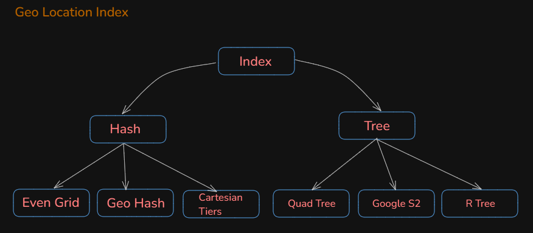
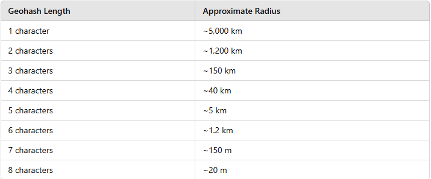
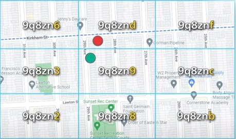

## Geo Spatial Index

`why normal database index is not sufficient for geo location data`
Traditional indexes work well with one-dimensional data, like integers or strings. However, geolocation data is two-dimensional (latitude and longitude), and queries often involve spatial relationships and distances that are hard to represent in a single index. B-trees, for example, work on ranges in one dimension, making them inefficient for two-dimensional data.

`what if i index both the latitude and longitude columns? Will it then be possible to efficiently search geo location data`
A query for nearby points (within a radius, for example) needs to calculate distances based on both latitude and longitude simultaneously
As a result, such queries would require scanning both indexes, calculating distances manually, and then filtering results — which is computationally expensive and slow for large datasets.
these indexes work best for fixed ranges rather than radial distances. For example, finding all points within a 5 km radius is not the same as finding all points within a latitude and longitude range (a bounding box). Without a spatial index, the database won’t efficiently know how to constrain the search to nearby points.

`Solution`
By converting each two-dimensional point into a one-dimensional value (like a latitude-longitude pair), we can create a spatial index. This technique, known as a "geospatial index," allows us to efficiently  perform range queries on geolocation data.
Even if implementation is different, High level idea of below is to divide the map into small areas and build index for fast searching.

**Even Grid** : Divide the map into a grid
                Bigger Grid for sparsely populated areas, 
                smaller grid for densely populated areas.
                Grids are not evenly distributed.
                     

**RTree** : R-Tree is a self-balancing tree data structure for spatial indexing.
              It allows efficient range queries and nearest neighbor searches.

**Geo Hash** : Geohash is an improved version of the geospatial index, 
               It reduces two dimensional location data to a single string.
               It divides the world into 4 grids along prime meridian and equator.
               Each quadrant/grid is represented by 2 bits.
               Each grid is again subdivided into 4 quadrants/grids, and so on.
               Each sub Grid is represented by 2 bits appended to the bits from previous grid.
               In order to avoid a long series of 1s and 0s , Geo Hash converts it into a base32 string.
               the length of Geo Hash string determines the size of the area it represents(precision level).below chart shows 12 such levels.
               anything bigger than 6, grid size is too small.
               anything smaller than 4, grid size is too large.
               `How to choose the right precision level based on search radius? `
                To identify the best precision level for a search radius in geohashing, you should match the geohash length to the approximate size of the desired radius:
                usual search query can read data from 8 neighboring grids.

  

 

`How to design a GeoHash Index?`
- create a table geospatial_index with columns: geohash, business_id/user_id
- For each business, calculate the geohash and insert it into the index table.
- There are libraries available to convert a latitude and longitude into a geohash.
- many businesses will share the same geohash.
- To search for businesses within a given geohash range, you can use a binary search on the geohash index.
- You can also keep latitude and longitude as separate columns in the geospatial_index table which will help in calculating distance between two geohash points.
- appliction will calculate distance between two geohash points using Haversine formula and rank the businesses based on distance before returning the results.
- `select business_id from geospatial_index where geohash like '9q8zn%'`
- `How to scale the geohash index?`
  - size of table contents will be less but read will be high
  - we need to spread the read load - sharding or replication.
  - sharding is complicated as we require sharding logic in application layer
  - moreover the entire data is small and can fit in one database server, no need of sharding.
  - better approach is to have read replicas for high read performance.less complex than sharding.
  

Quad Tree : A Quadtree is a data structure that recursively divides a two-dimensional space into four quadrants until it meets certain criteria(eg: total nmbr of businesses). 
            It's an in memory data structure and not a database solution.
            Its' has to be developed using a programming language and runs on server-side.
            It is a space-partitioning data structure that is used in computer graphics, computer vision, and game development.
