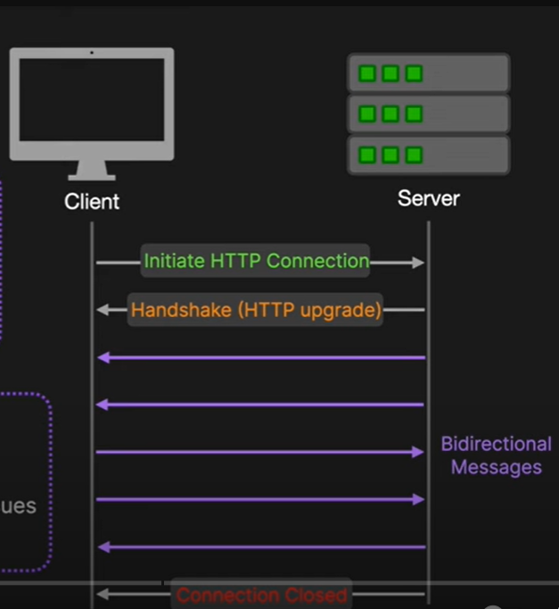

### Long Polling:

1. Client makes a HTTP request to server
2. Server keeps the request open until it has new data or a timeout occurs
3. Pros:
    - Compatible
    - Simple
    - Fallback Option
4. Cons:
    - Latency
    - HTTP Overhead
    - Scalability

### Server-Sent Events(SSE)

1. Unidirectional Communication
2. Server pushes events to client over an HTTP connection
3. Pros:
    - Simple
    - Efficient
    - Automatic reconnect
    - Suitable for Notifications, Live Location updates
4. Cons:
    - Not suitable for 2 way communication
    - Browser Support

### Web Socket
1. Full Duplex communication over a single long-lived TCP connection
2. Enables real-time , bidirectional communication.
3. Pros:
    - Low latency
    - Bidirectional communication
    - Efficient
4. Cons:
    - Complex
    - Scalability

### QUIC(Quick UDP Internet Connection)

1. Developed and used by Uber
2. Transport layer network protocol
3. Designed to improve the performance of HTTP/2 and HTTP/3 by running over UDP
4. Performant, Security
    